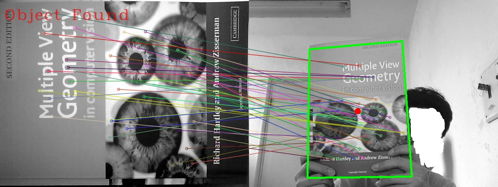

#Object detection Repository
## 1. SURF(Speeded-Up Robust Features)
**SURF based object detection**

###1.1 /SURF
This folder contains some codes which are written and tested in OpenCV 2.4.9, an object image is needed before running this code



    Step1 : detect all the scale invariant feature/interesting points for the prepared image
	Step2 : build up the descriptors for these points
	Step3 : use BFMatcher/FlannBasedMatcher find good matching for these feature points according to the descriptors
	Step4 : perspectiveTransform the points in the prepared image to the current screne
	Step5 : draw matches and the detected object(boudary corners and the center)
###1.2 /SURF_OpenCV3.1
These are also the SURF based object detection codes, however, it is based on the Opencv3.1 and [opencv_contrib](https://github.com/Itseez/opencv_contrib), considering the SURF now is moved out to opencv_contrib.

**Method 1**: use `knnMatch()` to find `std::vector<std::vector<DMatch> >& matches` , and if `matches[i][0].distance < 0.6*(matches[i][1].distance))`, then this match is added to `vector<DMatch> good_matches`
 
**Method 2**: use `std::sort(matches.begin(), matches.end())` to sort the matches and calculate the minimum distance by `double minDist = matches.front().distance`, then select the matches meeting `matches[i].distance < (1.2~1.6) * minDist` as good_matches

Both methods set a `thresholdGoodMatches` for the number of good_matches, if larger then 20~30, then we think the object is found. These parameters can be modified for perticular circumstance.

**Something should be paid attention to**:

	1. current captured screne frame may not always exist keypoints, for example the camera is blocked.

```cpp
if (!obj_descritor.empty() && !screne_descritor.empty())
{
	//details
}
```

    2. the Homography Matrix may not always be found 

```cpp
Mat H = findHomography(obj_SURFkp, scene_SURFkp, RANSAC);
if (!H.empty())//Homography Matrix may not be found
{
	//details
}
```
## 2. Cascade Classification
	Step1 : use \gen_img\gen_neg.py and \gen_img\gen_pos.py to generate positive and negative images and store these images to \prepared_img\neg and \prepared_img\pos folder.
	Step2 : use \prepared_img\pos\route.bat to generate the information for positive images(pos.dat) and use \prepared_img\neg\gen_negpath.py for negative images(neg.dat).
	Step3 : use \obj_boxselect to find the object in the positive images and add these information(pixel coordinate for box's four corners) to \prepared_img\pos\pos.dat
	Step4 : use create_obj_samples.bat and opencv_createsamples.exe to generate \prepared_img\pos\obj.vec, the parameters in create_obj_samples.bat should be modified for particular use.
	Step5 : use train_cascade.bat and opencv_traincascade.exe to train the classifier and store the result in \trainclassifier